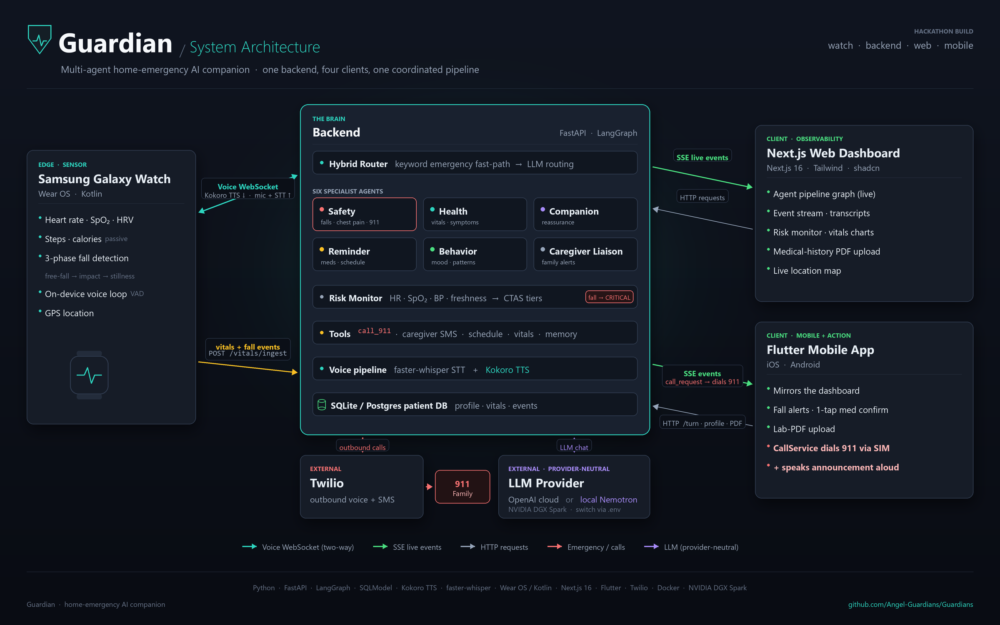

# Guardian — Home Emergency AI Companion

> For people who live alone: a smartwatch senses a fall or a vitals anomaly, a
> six-agent backend understands what happened and **acts** — calling 911 with the
> person's full medical context and alerting family — while caregivers watch every
> step live. Health data can run **entirely on local hardware**.
>
> Built over one weekend at **NVIDIA Spark Hack · Toronto**.

[](https://youtu.be/Dbwv6Ej0kT0)

<p align="center">▶ <a href="https://youtu.be/Dbwv6Ej0kT0"><b>Watch the 60-second demo on YouTube</b></a></p>

---

## What it is

Guardian is **one backend and four clients**, wired into a single coordinated pipeline:

```
Samsung Watch ──vitals + fall events──▶ FastAPI backend ──SSE──▶ Next.js dashboard
      │              ▲                        │                   Flutter app
      └── voice WS ──┘                   LangGraph router
      (Kokoro TTS in / mic+STT out)      → 6 specialist agents
                                         → tools (911, SMS, schedule, vitals, memory)
                                         → local SQLite / Postgres DB
```

A **hybrid router** sends each message or sensor event to one of **six specialist
agents**; agents call tools through a tool loop. The LLM is reached only through a
**provider-neutral seam**, so the same code runs on **OpenAI cloud** or a **local
Nemotron Nano model (NVFP4, served through TensorRT) on an NVIDIA DGX Spark** —
changing `.env` is the only difference.

See [`ARCHITECTURE.md`](ARCHITECTURE.md) for the design vision and
[`CODEBASE_MAP.md`](CODEBASE_MAP.md) for what actually runs today.

---

## The parts, and how they interact

| Part | Path | Stack | Role |
|---|---|---|---|
| **Backend / API** | `backend/` | Python 3.11+, FastAPI, LangGraph, SQLModel | the hub — router, six agents, tools, voice, DB, event bus |
| **Web dashboard** | `frontend/` | Next.js 16, Tailwind, shadcn/ui, Recharts, Leaflet | live observability over SSE |
| **Mobile app** | `flutter_frontend/` | Flutter (Dart) | mobile mirror; **dials 911 through the phone and speaks the alert** |
| **Smartwatch** | `watch/` | Wear OS (Kotlin), Health Services / Health Connect | the frontline sensor — vitals, fall detection, on-device voice |

**The flow:** the watch streams vitals and fall events to the backend (`POST
/vitals/ingest`) and opens a **bidirectional voice WebSocket** when risk is detected
(Kokoro TTS streams down to the watch speaker; the mic + transcription stream up).
The backend pushes every routing decision, tool call, risk score and reply to the
dashboard and Flutter app over **Server-Sent Events**. When something is critical the
Safety agent calls 911 (Twilio) with the person's full profile, and a call bridge
pushes a `call_request` so the phone can place the call itself.

---

## How the brain works

- **Hybrid router** (`backend/agents/guardian.py`) — a keyword fast-path catches
  emergencies (`"I fell"`, `"chest pain"`) and routes to **Safety** before the LLM
  ever runs; everything else is classified by the model.
- **Six specialist agents** — each with its own prompt, tool subset, voice, and
  escalation ceiling:

  | Agent | Handles | Can dispatch 911? |
  |---|---|---|
  | **Safety** | falls, chest pain, breathing trouble | ✅ **only this agent** |
  | **Health** | vitals anomalies, symptoms, chronic conditions | — |
  | **Companion** | calm-keeping, reassurance while help is en route | — |
  | **Reminder** | medications, appointments, daily schedule | — |
  | **Behavior** | mood, confusion, withdrawal patterns | — |
  | **Caregiver Liaison** | family alerts, incident summaries, outbound notices | — |

- **Weighted risk monitor** (`backend/services/risk_monitor.py`) — scores live
  vitals (heart rate, SpO₂, blood pressure, data freshness) into CTAS-aligned
  severity tiers; a recent **fall instantly forces CRITICAL**.
- **Voice loop** (`backend/api/voice.py`, `backend/voice/`) — `faster-whisper` STT →
  router → agent → `Kokoro` TTS, streamed both ways over a WebSocket to the watch.
- **Tools** (`backend/tools/`) — `call_911`, `notify_caregiver`, `call_person`,
  `get_schedule`, `mark_med_taken`, `log_vital`, `recall_history`, `find_cool_space`
  (Twilio-backed calls are **idempotent** — a retry never double-dials).
- **Provider-neutral LLM seam** (`backend/llm/`) — the only place that imports a
  vendor SDK. OpenAI cloud by default; point `LLM_*` at any OpenAI-compatible
  endpoint (TensorRT-LLM, vLLM, Ollama, NIM) to run fully local.

---

## Demo

▶ **[Watch the 60-second demo on YouTube](https://youtu.be/Dbwv6Ej0kT0)** — the watch and
the agent system, side by side, on one synchronized clock.

Rendered from a real run on the running app (Eleanor, a fall + chest pain). Source clips:
- ⌚ **[Watch loop](demo/guardian-watch-demo.mp4)** — vitals → 3-phase fall detection
  → "Are you OK?" → two-way voice.
- 💻 **[Dashboard / backend flow](demo/guardian-live-demo.mp4)** — message → Safety →
  `call_911` + caregiver alert → reply → risk gauge.
- 🗺️ **[System architecture](demo/guardian-architecture.png)** — the diagram above.

See [`demo/SCENARIO_WALKTHROUGHS.md`](demo/SCENARIO_WALKTHROUGHS.md) for the scripted
scenarios.

---

## Quickstart

The backend is the hub — **start it first**; every UI connects to it over HTTP/SSE.
The SQLite database auto-creates and seeds demo patients **Eleanor** and **Sarah** on
first run.

### 1. Backend / API

```bash
cp .env.example .env          # set LLM_API_KEY=sk-...   (LLM_MODEL=gpt-4o-mini)
pip install -e ".[dev]"       # installs the guardian package + dev tools
python -m uvicorn backend.main:app --host 127.0.0.1 --port 8000
```

Talk to Guardian over HTTP:

```bash
curl -s localhost:8000/turn/ -H 'content-type: application/json' \
  -d '{"text":"I fell and my chest feels tight", "patient_id":1}' | jq
# -> {"route":"safety","reply":"...","tool_calls":[{"tool":"call_911",...}]}
```

The routing decision, every tool call, risk score and reply also stream on
`GET /events/sse` (the **Live** page). Interactive API docs: <http://localhost:8000/docs>.

> Run backend/DB commands from the **repo root** (`DATABASE_URL` is relative to the
> cwd). If pip console scripts aren't on PATH, use the `python -m …` forms above.

### 2. Web dashboard

```bash
cd frontend && npm install && npm run dev      # http://localhost:3000
```

Pick a profile on first load. Pages: **Home · Live · Vitals · Reminders · Profile ·
Location · Medical history · Admin**. Point at a non-default backend with
`frontend/.env.local` → `NEXT_PUBLIC_API_BASE_URL=http://localhost:8000`.

### 3. Mobile app

```bash
cd flutter_frontend && flutter pub get && flutter run
```

Mirrors the dashboard mobile-first; when Guardian triggers `call_911` it dials 911
through the phone's own line and speaks the announcement on speakerphone. Details in
[`flutter_frontend/README.md`](flutter_frontend/README.md).

### 4. Smartwatch

Open `watch/` in Android Studio, run the `app` config on a Wear OS device/emulator,
grant sensor/mic permissions, then set the **Backend URL** (your LAN IP) and
**Patient ID** in the watch's Settings. Full instructions in
[`watch/README.md`](watch/README.md).

---

## Configuration (`.env`)

| Variable | Purpose |
|---|---|
| `LLM_API_KEY`, `LLM_MODEL`, `LLM_BASE_URL` | the LLM backend (cloud or local) |
| `DATABASE_URL` | `sqlite:///./guardian.db` (default) or a Postgres URL |
| `TWILIO_*` | real SMS/calls for the safety & caregiver tools (optional in dev) |
| `TTS_BACKEND` | `kokoro` (local, default), `openai`, or `auto` |
| `MEMORY_BACKEND` | `keyword` (default) or `pgvector` for RAG recall |
| `LAB_DOCUMENTS_DIR` | where uploaded lab-result PDFs are stored |

**Cloud ↔ local DGX Spark** is a change to the `LLM_*` block only — no code changes.
On the Spark we deployed **Nemotron Nano quantized to NVFP4** and served it through
**TensorRT**; any OpenAI-compatible endpoint works. See
[`SETUP_DGX_SPARK.md`](SETUP_DGX_SPARK.md) and [`MODELS.md`](MODELS.md).

---

## Database

- **SQLite by default** — zero setup. Tables are created and the schema is
  auto-migrated on startup; demo patients **Eleanor** and **Sarah** are seeded if the
  DB is empty. Re-seed: `python -c "from backend.db.seed import seed_all; seed_all()"`.
- **Postgres / pgvector (optional, for RAG):** `docker compose up -d postgres`, set
  `DATABASE_URL=postgresql+psycopg://…`, then `pip install -e ".[rag]"`.

---

## Testing & quality

```bash
python -m pytest                       # from the repo root
ruff check backend tests scripts && ruff format backend tests scripts
```

The testcontainers-**Postgres** tests need Docker; the **smoke** test places a real
Twilio call and fails with HTTP 401 without valid `TWILIO_*` creds — both are
environmental, not code failures.

---

## Repo layout

```
backend/
  llm/          provider-neutral LLM seam (the ONLY place that imports a vendor SDK)
  agents/       guardian.py (router) + graph.py + 6 specialists + prompts/
  tools/        registry + emergency, health, reminder, civic, memory
  services/     risk_monitor, fall_response, lab_records, medical_history_extract, patient_profile
  voice/        kokoro_tts, stt, tts, call_audio, monitor (the voice WebSocket tier)
  api/          turn, vitals, voice, events_sse, risk, location, lab_records, patient, admin, call_bridge
  events/       in-proc pub/sub bus + typed event models
  db/           SQLModel models, session (engine + auto-migrate), seed
frontend/          Next.js 16 dashboard (Home/Live/Vitals/Reminders/Profile/Location/Medical history/Admin)
flutter_frontend/  Flutter mobile/desktop client
watch/             Wear OS app — real vitals + fall detection + voice
demo/              architecture diagram, demo videos, scenario walkthroughs, personas
scripts/           phase0.py, try_live.py, seed_patient.py, inject_vital.py, demo_reset.py
```

---

## Docs

[`ONBOARDING.md`](ONBOARDING.md) (guided reading path) ·
[`ARCHITECTURE.md`](ARCHITECTURE.md) (design vision) ·
[`CODEBASE_MAP.md`](CODEBASE_MAP.md) (what runs today) ·
[`MODELS.md`](MODELS.md) · [`SETUP_DGX_SPARK.md`](SETUP_DGX_SPARK.md) ·
[`EXTENDING.md`](EXTENDING.md) · [`DOCKER.md`](DOCKER.md)
