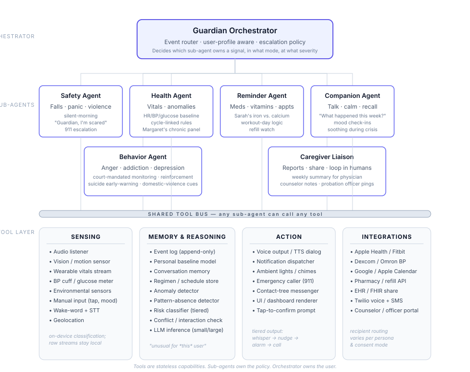

# Guardian — Agent Architecture

Guardian is a personal-safety and wellbeing agent. It spans use cases as different as a grandmother's fall in the middle of the night, a 30-year-old's vitamin schedule, a court-monitored anger-management case, and a senior's complex multi-medication routine. The architecture below splits that surface area into one orchestrator, a small set of specialist sub-agents, and a shared, reusable tool layer.

---

## System diagram

> If your markdown viewer doesn't render the embedded SVG, open `guardian_architecture.svg` directly in any browser.

Inline SVG (click to expand)

<svg viewBox="0 0 960 760" xmlns="http://www.w3.org/2000/svg" width="100%" role="img" font-family="ui-sans-serif, system-ui, -apple-system, Segoe UI, sans-serif">
  <title>Guardian agent architecture</title>
  <desc>Orchestrator on top, six sub-agents in the middle, four shared tool buckets on the bottom.</desc>
  
  <g class="tier-label" text-anchor="end">
    <text x="70" y="78">ORCHESTRATOR</text>
    <text x="70" y="218">SUB-AGENTS</text>
    <text x="70" y="478">SHARED TOOL LAYER</text>
  </g>
  <rect x="280" y="40" width="400" height="80" rx="10" fill="#eef2ff" stroke="#4f46e5" stroke-width="1.8"/>
  <text x="480" y="68" text-anchor="middle" class="box-title-lg">Guardian Orchestrator</text>
  <text x="480" y="90" text-anchor="middle" class="box-sub">Event router · user-profile aware · escalation policy</text>
  <text x="480" y="107" text-anchor="middle" class="box-detail">Decides which sub-agent owns a signal, in what mode, at what severity</text>
  <g stroke="#cbd5e1" stroke-width="1" fill="none">
    <path d="M480 120 V 150 H 165 V 175"/>
    <path d="M480 120 V 150 H 350 V 175"/>
    <path d="M480 120 V 150 H 535 V 175"/>
    <path d="M480 120 V 150 H 720 V 175"/>
    <path d="M480 120 V 150 H 292 V 300"/>
    <path d="M480 120 V 150 H 668 V 300"/>
  </g>
  <rect x="80" y="175" width="170" height="105" rx="8" fill="#fff" stroke="#6366f1" stroke-width="1.5"/>
  <text x="165" y="200" text-anchor="middle" class="box-title">Safety Agent</text>
  <text x="165" y="222" text-anchor="middle" class="box-sub">Falls · panic · violence</text>
  <text x="165" y="240" text-anchor="middle" class="box-detail">silent-morning</text>
  <text x="165" y="254" text-anchor="middle" class="box-detail">"Guardian, I'm scared"</text>
  <text x="165" y="268" text-anchor="middle" class="box-detail">911 escalation</text>
  <rect x="265" y="175" width="170" height="105" rx="8" fill="#fff" stroke="#6366f1" stroke-width="1.5"/>
  <text x="350" y="200" text-anchor="middle" class="box-title">Health Agent</text>
  <text x="350" y="222" text-anchor="middle" class="box-sub">Vitals · anomalies</text>
  <text x="350" y="240" text-anchor="middle" class="box-detail">HR/BP/glucose baseline</text>
  <text x="350" y="254" text-anchor="middle" class="box-detail">cycle-linked rules</text>
  <text x="350" y="268" text-anchor="middle" class="box-detail">Margaret's chronic panel</text>
  <rect x="450" y="175" width="170" height="105" rx="8" fill="#fff" stroke="#6366f1" stroke-width="1.5"/>
  <text x="535" y="200" text-anchor="middle" class="box-title">Reminder Agent</text>
  <text x="535" y="222" text-anchor="middle" class="box-sub">Meds · vitamins · appts</text>
  <text x="535" y="240" text-anchor="middle" class="box-detail">Sarah's iron vs. calcium</text>
  <text x="535" y="254" text-anchor="middle" class="box-detail">workout-day logic</text>
  <text x="535" y="268" text-anchor="middle" class="box-detail">refill watch</text>
  <rect x="635" y="175" width="170" height="105" rx="8" fill="#fff" stroke="#6366f1" stroke-width="1.5"/>
  <text x="720" y="200" text-anchor="middle" class="box-title">Companion Agent</text>
  <text x="720" y="222" text-anchor="middle" class="box-sub">Talk · calm · recall</text>
  <text x="720" y="240" text-anchor="middle" class="box-detail">"What happened this week?"</text>
  <text x="720" y="254" text-anchor="middle" class="box-detail">mood check-ins</text>
  <text x="720" y="268" text-anchor="middle" class="box-detail">soothing during crisis</text>
  <rect x="172" y="300" width="240" height="100" rx="8" fill="#fff" stroke="#6366f1" stroke-width="1.5"/>
  <text x="292" y="325" text-anchor="middle" class="box-title">Behavior Agent</text>
  <text x="292" y="347" text-anchor="middle" class="box-sub">Anger · addiction · depression</text>
  <text x="292" y="365" text-anchor="middle" class="box-detail">court-mandated monitoring · reinforcement</text>
  <text x="292" y="379" text-anchor="middle" class="box-detail">suicide early-warning · domestic-violence cues</text>
  <rect x="548" y="300" width="240" height="100" rx="8" fill="#fff" stroke="#6366f1" stroke-width="1.5"/>
  <text x="668" y="325" text-anchor="middle" class="box-title">Caregiver Liaison</text>
  <text x="668" y="347" text-anchor="middle" class="box-sub">Reports · share · loop in humans</text>
  <text x="668" y="365" text-anchor="middle" class="box-detail">weekly summary for physician</text>
  <text x="668" y="379" text-anchor="middle" class="box-detail">counselor notes · probation officer pings</text>
  <g stroke="#cbd5e1" stroke-width="1" fill="none">
    <path d="M165 280 V 430"/>
    <path d="M350 280 V 430"/>
    <path d="M535 280 V 430"/>
    <path d="M720 280 V 430"/>
    <path d="M292 400 V 430"/>
    <path d="M668 400 V 430"/>
  </g>
  <rect x="80" y="430" width="800" height="14" rx="7" fill="#e2e8f0" stroke="#94a3b8" stroke-width="1"/>
  <text x="480" y="441" text-anchor="middle" class="bus-label">SHARED TOOL BUS — any sub-agent can call any tool</text>
  <rect x="80" y="465" width="190" height="270" rx="10" fill="#f8fafc" stroke="#cbd5e1" stroke-width="1"/>
  <text x="175" y="488" text-anchor="middle" class="bucket-title">SENSING</text>
  <line x1="95" y1="498" x2="255" y2="498" stroke="#cbd5e1"/>
  <g class="bucket-item">
    <text x="100" y="518">• Audio listener</text>
    <text x="100" y="538">• Vision / motion sensor</text>
    <text x="100" y="558">• Wearable vitals stream</text>
    <text x="100" y="578">• BP cuff / glucose meter</text>
    <text x="100" y="598">• Environmental sensors</text>
    <text x="100" y="618">• Manual input (tap, mood)</text>
    <text x="100" y="638">• Wake-word + STT</text>
    <text x="100" y="658">• Geolocation</text>
  </g>
  <text x="100" y="690" class="bucket-note">on-device classification;</text>
  <text x="100" y="704" class="bucket-note">raw streams stay local</text>
  <rect x="285" y="465" width="195" height="270" rx="10" fill="#f8fafc" stroke="#cbd5e1" stroke-width="1"/>
  <text x="382" y="488" text-anchor="middle" class="bucket-title">MEMORY &amp; REASONING</text>
  <line x1="300" y1="498" x2="465" y2="498" stroke="#cbd5e1"/>
  <g class="bucket-item">
    <text x="305" y="518">• Event log (append-only)</text>
    <text x="305" y="538">• Personal baseline model</text>
    <text x="305" y="558">• Conversation memory</text>
    <text x="305" y="578">• Regimen / schedule store</text>
    <text x="305" y="598">• Anomaly detector</text>
    <text x="305" y="618">• Pattern-absence detector</text>
    <text x="305" y="638">• Risk classifier (tiered)</text>
    <text x="305" y="658">• Conflict / interaction check</text>
    <text x="305" y="678">• LLM inference (small/large)</text>
  </g>
  <text x="305" y="710" class="bucket-note">"unusual for *this* user"</text>
  <rect x="495" y="465" width="190" height="270" rx="10" fill="#f8fafc" stroke="#cbd5e1" stroke-width="1"/>
  <text x="590" y="488" text-anchor="middle" class="bucket-title">ACTION</text>
  <line x1="510" y1="498" x2="670" y2="498" stroke="#cbd5e1"/>
  <g class="bucket-item">
    <text x="515" y="518">• Voice output / TTS dialog</text>
    <text x="515" y="538">• Notification dispatcher</text>
    <text x="515" y="558">• Ambient lights / chimes</text>
    <text x="515" y="578">• Emergency caller (911)</text>
    <text x="515" y="598">• Contact-tree messenger</text>
    <text x="515" y="618">• UI / dashboard renderer</text>
    <text x="515" y="638">• Tap-to-confirm prompt</text>
  </g>
  <text x="515" y="680" class="bucket-note">tiered output:</text>
  <text x="515" y="694" class="bucket-note">whisper → nudge →</text>
  <text x="515" y="708" class="bucket-note">alarm → call</text>
  <rect x="700" y="465" width="180" height="270" rx="10" fill="#f8fafc" stroke="#cbd5e1" stroke-width="1"/>
  <text x="790" y="488" text-anchor="middle" class="bucket-title">INTEGRATIONS</text>
  <line x1="715" y1="498" x2="865" y2="498" stroke="#cbd5e1"/>
  <g class="bucket-item">
    <text x="715" y="518">• Apple Health / Fitbit</text>
    <text x="715" y="538">• Dexcom / Omron BP</text>
    <text x="715" y="558">• Google / Apple Calendar</text>
    <text x="715" y="578">• Pharmacy / refill API</text>
    <text x="715" y="598">• EHR / FHIR share</text>
    <text x="715" y="618">• Twilio voice + SMS</text>
    <text x="715" y="638">• Counselor / officer portal</text>
  </g>
  <text x="715" y="680" class="bucket-note">recipient routing</text>
  <text x="715" y="694" class="bucket-note">varies per persona</text>
  <text x="715" y="708" class="bucket-note">&amp; consent mode</text>
  <text x="480" y="752" text-anchor="middle" class="footer">Tools are stateless capabilities. Sub-agents own the policy. Orchestrator owns the user.</text>
</svg>

---

## The orchestrator

**Guardian Orchestrator** is the single entry point. It owns:

- The **user profile** — who this is, what conditions they have, what mode they're in (court-mandated monitoring vs. opt-in wellness tracking vs. caregiver-relayed minor).
- **Event routing** — when a signal arrives (a thump, a "Guardian I'm scared," a missed kettle), it decides which sub-agent gets to act on it.
- **Escalation policy** — the rules that lift a soft check-in into an alarm and finally into a 911 call. Sub-agents recommend a severity; the orchestrator is what actually pulls the trigger.

Sub-agents never talk to each other directly. They publish observations and recommendations back to the orchestrator, and it fans out the next move. This keeps the system auditable — for the court-mandated and caregiver cases, every escalation can be traced to one decision point.

---

## The six sub-agents

Each sub-agent is a **policy domain**, not a persona. One persona (Margaret) will trigger several sub-agents over the course of a day; one sub-agent (Safety) serves every persona.

| Sub-agent | Owns | Example triggers |
|---|---|---|
| **Safety Agent** | Imminent physical harm | Fall thump, broken glass, panic phrase, silent-morning pattern absence |
| **Health Agent** | Vitals and chronic-condition signals | HR deviation from baseline, BP trend, glucose out of range, post-menopausal iron logic |
| **Reminder Agent** | Schedules and adherence | Sarah's vitamin stack, Margaret's BP-med-same-time-every-day, refill prediction, appointment prep |
| **Companion Agent** | Conversation, calming, recall | "What happened this week?", mood check-in, talking the user through the wait for EMS |
| **Behavior Agent** | Long-horizon behavioral monitoring | Anger-outbreak precursors, depression slide, addiction cues, domestic-violence escalation |
| **Caregiver Liaison** | Communication to *other humans* | Weekly summary to physician, counselor notes, family pings, probation officer reports |

A few design notes on why the split lands here:

- **Safety vs. Behavior** are separated by time horizon: Safety is seconds, Behavior is days/weeks. A raised voice could matter to either, but the response is completely different.
- **Health vs. Reminder** are separated by problem type: Health is a sensing/anomaly problem, Reminder is a planning/adherence problem. They share data (Reminder logs go into Health's baseline), but the policies are unrelated.
- **Caregiver Liaison** is the only sub-agent that talks to other humans. Centralizing this means consent rules are enforced in one place, and the user gets one consistent voice when their counselor or doctor reads the notes.

---

## The shared tool layer

Tools are **stateless capabilities**. They do one narrow thing well and don't know which sub-agent is calling them. Any sub-agent can call any tool — that's the whole point of the shared bus.

### Sensing

How Guardian perceives the world.

- **Audio listener** — ambient sound classification (fall thump, raised voices, breaking glass, crying, silence-where-there-shouldn't-be-silence) plus wake-word and speech-to-text.
- **Vision / motion sensor** — camera or PIR for fall detection, presence, no-movement windows, caregiver behavior monitoring. On-device inference; raw video does not leave the device.
- **Wearable vitals stream** — HR, HRV, SpO₂, sleep, steps from the wrist.
- **BP cuff / glucose meter** — discrete readings rather than streams; pulled at scheduled prompts.
- **Environmental sensors** — kettle, door, light, temperature. The signals behind "the kettle didn't go on this morning."
- **Manual input** — tap-to-confirm, mood slider, pain level. Lowest-tech, highest-reliability.
- **Wake-word + STT** — opens the dialogue channel.
- **Geolocation** — needed for emergency dispatch and for behavioral cases (am I at a place I'm trying to avoid).

### Memory & reasoning

What Guardian remembers and how it judges.

- **Event log (append-only)** — every observation, timestamped. Local-first. Tamper-evident copy for legal cases.
- **Personal baseline model** — per-user rolling statistics: typical wake time, resting HR range, voice-stress baseline. **The single most important tool**; it's what lets Guardian say "this is unusual *for you*" instead of using one-size-fits-all thresholds.
- **Conversation memory** — durable notes from spoken exchanges so Companion can answer "what happened this week?"
- **Regimen / schedule store** — Sarah's vitamin stack with the iron-vs-calcium conflict rules, Margaret's medication panel, workout-day vs. rest-day logic, cycle phase.
- **Anomaly detector** — compares live signals to the baseline; outputs a tiered deviation level.
- **Pattern-absence detector** — separate from anomaly detection because "nothing happened" is harder than "something weird happened." Powers the silent-morning case.
- **Risk classifier** — turns observations into a severity tier (whisper / nudge / alarm / call) so the action layer knows what to do.
- **Conflict / interaction checker** — "don't remind iron and calcium at the same time," "metformin needs food," "BP med + standing up too fast."
- **LLM inference** — two modes. Small/local for low-stakes back-and-forth; larger/cloud for summaries and harder judgment calls.

### Action

How Guardian acts on the world.

- **Voice output / TTS dialog** — calm, age-tuned, bidirectional. The "talk to her, calm her down" tool.
- **Notification dispatcher** — chimes, phone push, smart-display banners.
- **Ambient lights / chimes** — gentle escalation tool for the silent-morning case before going to a louder alarm.
- **Emergency caller (911)** — regulated telephony integration (Twilio Voice or a medical-alert provider like Lively/Bay Alarm). Auto-generates a situation summary spoken to the dispatcher.
- **Contact-tree messenger** — SMS/voice/WhatsApp to family, caregiver, counselor, probation officer. Recipient list varies per persona.
- **UI / dashboard renderer** — Sarah's vitamin tracker UI, Margaret's weekly report. Reads from the event log.
- **Tap-to-confirm prompt** — the "I'm okay" daily signal whose *absence* triggers a check.

### Integrations

External systems Guardian plugs into.

- **Apple Health / Fitbit / Google Health Connect** — wearable data.
- **Dexcom / Omron BP** — medical device data.
- **Google / Apple Calendar** — appointments and refill timing.
- **Pharmacy / refill API** — CVS, Walgreens, Amazon Pharmacy, or Surescripts.
- **EHR / FHIR share** — push weekly summaries to a physician.
- **Twilio voice + SMS** — outbound telephony.
- **Counselor / officer portal** — the channel Caregiver Liaison uses for court-mandated and counseling cases.

---

## Why tools are reusable

A single fall event needs tools from every bucket simultaneously: audio + vision + vitals from Sensing, baseline + risk classifier from Memory & Reasoning, voice output + emergency caller + contact messenger from Action. And those tools get called by *three different sub-agents in parallel* — Safety triggers the 911 call, Companion keeps the woman talking, Caregiver Liaison pings the daughter — all hitting the shared bus.

If each sub-agent owned its own "call 911," you'd end up with three different implementations and three different consent rules. By treating tools as stateless capabilities on a shared bus, you get:

1. **One consent model per tool** — the emergency caller checks consent once, not six times.
2. **One audit trail** — every tool invocation logs which sub-agent called it and why.
3. **Cheap new sub-agents** — adding a new specialist (say, a Sleep Coach) costs almost nothing because the tools already exist.

---

## Cross-cutting concerns

These aren't tools but they shape every tool above.

- **Consent & mode switching** — the court-mandated user, the elderly grandmother, and Sarah have wildly different consent profiles. Tools carry a permission contract, not just an on/off switch.
- **Privacy boundary** — audio/video classify on-device and only ship features, not raw streams. Critical for the domestic-violence and child-monitoring cases where the data is also evidence.
- **Failover** — local emergency-call capability is non-negotiable. If the network is down during a fall, Guardian still rings the phone-line backup.
- **Audit log** — separate from the event log, tamper-evident, for cases where the log itself is legal evidence.
